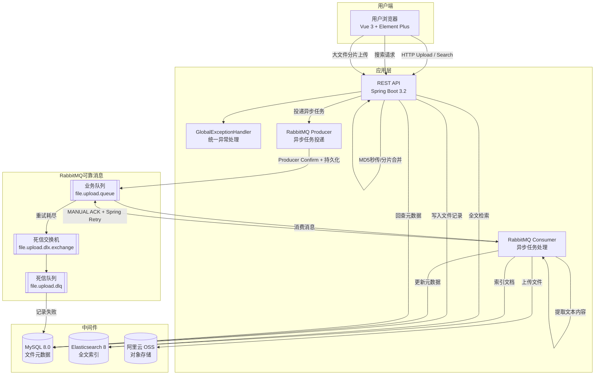

# Smart File Processor

<div align="center">

**企业级文件处理与全文检索系统**

[](https://openjdk.org/)
[](https://spring.io/projects/spring-boot)
[](./LICENSE)
[](https://gradle.org/)
[]()

</div>

---

## 📖 目录

- [项目简介](#项目简介)
- [核心架构](#核心架构)
- [技术亮点](#技术亮点)
- [技术栈](#技术栈)
- [已实现功能](#已实现功能)
- [快速启动](#快速启动)
- [API 速查](#api-速查)
- [项目结构](#项目结构)
- [规划路线图](#规划路线图)
- [项目文档](#项目文档)
- [关于作者](#关于作者)

---

## 项目简介

企业级文件处理与全文检索系统，围绕"文件上传 → 异步解析 → 索引同步 → 全文检索"构建完整后端链路。

项目基于 Spring Boot 3.2 + MyBatis + RabbitMQ + Elasticsearch 实现，支持大文件分片上传、MD5 秒传、断点续传、文件内容解析、全文检索和可靠消息一致性，重点体现 Java 后端项目中的异步处理、数据一致性、异常恢复和工程化测试能力。

**已实现能力**

- **上传链路**：MD5 秒传、分片上传（流式落盘）、断点续传、分片合并 MD5 校验
- **异步解析**：RabbitMQ 解耦上传与处理，Producer Confirm + MANUAL ACK + Spring Retry（指数退避 3 次）+ DLX/DLQ 三层可靠消息保障
- **全文检索**：Elasticsearch multiMatch（fileName + content），Transactional Outbox Pattern 实现 MySQL-ES 最终一致性
- **内容解析**：PDF（PDFBox）/ DOCX（POI）/ TXT 文本提取，含文件大小、页数、段落数、字符数多层 OOM 防护
- **工程化**：Docker Compose 一键部署中间件，55 个单元测试（JUnit 5 + Mockito），全局异常处理

> 💡 **Future Backlog**：AI 文档问答（RAG/LLM/SSE）、Embedding + 向量检索等能力已列入远期规划，不在当前代码中实现。

---

## 核心架构



**数据流说明**：

1. **上传流（小文件）**：用户上传 → Controller 暂存本地 + 写 MySQL → 发送 RabbitMQ 消息 → 立即返回"已提交" → Consumer 异步处理
2. **上传流（大文件）**：MD5 秒传校验 → 分片初始化 → 逐片上传 → 分片合并 + MD5 校验 → 发送 RabbitMQ → Consumer 异步处理
3. **处理流**：Consumer 消费消息 → 上传 OSS → 提取文本（PDF/Word/TXT）→ 事务写 MySQL + outbox_event → 删除临时文件。OutboxSyncScheduler 异步同步 ES（幂等 upsert），失败指数退避重试（最多 5 次）。Consumer 失败时 Spring Retry 最多 3 次（2s→4s 指数退避），全部失败后进入 DLX/DLQ。
4. **搜索流**：用户搜索 → ES multiMatch 查询 → 拿 fileId 回查 MySQL → 返回完整文件信息

### RabbitMQ 可靠消息链路（3 层保障）

```
┌──────────────────────────────────────────────────────────┐
│ 第1层 · Producer Confirm + ReturnsCallback + 持久化       │
│   publisher-confirm-type: correlated                     │
│   mandatory: true → ReturnsCallback 暴露路由失败          │
│   deliveryMode: PERSISTENT, durable exchange/queue        │
├──────────────────────────────────────────────────────────┤
│ 第2层 · MANUAL ACK + Spring Retry                        │
│   acknowledge-mode: manual                               │
│   FileNotFoundException → basicNack(requeue=false) → DLQ │
│   可重试异常 → throw → Spring Retry (最多3次, 2s→4s)       │
├──────────────────────────────────────────────────────────┤
│ 第3层 · DLX/DLQ + DeadLetterConsumer                      │
│   重试耗尽 → file.upload.dlx.exchange → file.upload.dlq  │
│   DeadLetterConsumer: 记录日志 + 写入 DB PARSE_FAILED      │
└──────────────────────────────────────────────────────────┘
```

---

## 技术亮点

| 主题 | 实现要点 | 解决的问题 |
|------|---------|-----------|
| **上传链路** | MD5 秒传、分片上传（流式落盘）、断点续传、分片合并 MD5 校验 | 大文件单次上传易超时、失败需全量重传 |
| **异步解耦** | RabbitMQ 分离上传与处理，上传接口快速返回，后台异步完成 OSS 上传 + 文本提取 + ES 索引 | 同步处理用户体验差，大文件等待时间长 |
| **可靠消息** | Producer Confirm + MANUAL ACK + Spring Retry（指数退避 3 次）+ DLX/DLQ 死信兜底 + 消息持久化 | 消息丢失、Consumer 崩溃、重试耗尽无记录 |
| **数据一致性** | Transactional Outbox Pattern：同事务写入 outbox_event + 业务数据，定时调度异步同步 ES（幂等 upsert，失败指数退避重试最多 5 次） | MySQL 与 ES 无分布式事务支持，双写必然不一致 |
| **全文检索** | Elasticsearch multiMatch（fileName + content），回查 MySQL 返回完整元数据 | 文件名 + 内容联合搜索，单一数据源 |
| **解析安全** | PDF/DOCX/TXT 多层 OOM 防护（文件大小 + 页数 + 段落数 + 字符截断），损坏文件安全降级 | 大文件/恶意文件/损坏文件导致 JVM OOM |
| **测试覆盖** | 55 个单元测试（JUnit 5 + Mockito + MockMvc standalone），覆盖上传、分片、异常处理、消息可靠性、Outbox、文件解析等核心链路 | 重构无安全网，面试展示无质量背书 |

---

## 技术栈

### 后端

| 技术 | 版本 | 用途 |
|------|------|------|
| Spring Boot | 3.2.8 | 核心框架，REST API + 依赖管理 |
| MyBatis | 3.0.3 | ORM，注解式 SQL，无 XML |
| MySQL | 8.0+ | 文件元数据持久化 |
| RabbitMQ | 3.13+ | 异步消息队列，MANUAL ACK + DLX/DLQ + Producer Confirm |
| Elasticsearch | 8.12+ | 全文搜索引擎 |
| 阿里云 OSS | 3.17.4 | 对象存储，客户端单例复用 |
| Apache PDFBox | 3.0.1 | PDF 文本提取 |
| Apache POI | 5.2.5 | Word(.docx) 文本提取 |
| Gradle | 8.5 | 项目构建与依赖管理 |

### 前端

| 技术 | 用途 |
|------|------|
| Vue 3 CDN | 响应式 UI 框架 |
| Element Plus CDN | 企业级 UI 组件库（表格、上传、搜索） |

### 测试

| 技术 | 用途 |
|------|------|
| JUnit 5 | 测试框架 |
| Mockito | Mock 依赖 |
| MockMvc | Controller 层测试（standalone 模式） |

### 开发环境

| 工具 | 用途 |
|------|------|
| JDK 17 | 运行环境 |
| Docker + Docker Compose | 中间件一键部署 |
| IntelliJ IDEA | 推荐 IDE |

---

## 已实现功能

### 文件上传与管理
- [x] **文件上传** — 拖拽/点击上传，支持 PDF、Word、TXT、图片，单文件 ≤ 50MB
- [x] **MD5 秒传** — 文件已存在时跳过上传，直接复用已有记录
- [x] **分片上传** — 大文件分片（每片可配，流式落盘不占内存）、断点续传
- [x] **分片合并** — 流式合并 + MD5 校验，校验失败保留分片文件
- [x] **文件列表分页** — GET `/api/file/list?page=1&size=20`，无参数时返回全量数组（向后兼容）
- [x] **文件详情** — ID 查询，含内容、OSS URL、上传/解析状态

### 异步处理与可靠消息
- [x] **异步处理** — RabbitMQ 解耦，上传后立即返回，后台异步处理
- [x] **MANUAL ACK** — `acknowledge-mode: manual`，处理成功后手动确认
- [x] **Producer Confirm** — `publisher-confirm-type: correlated`，确认消息到达 Broker
- [x] **ReturnsCallback** — `mandatory: true`，捕获消息无法路由
- [x] **DLX/DLQ** — 重试耗尽后路由到死信队列，DeadLetterConsumer 记录 DB
- [x] **Spring Retry** — 最多 3 次，指数退避 2s→4s
- [x] **消息持久化** — `deliveryMode=PERSISTENT` + durable exchange/queue
- [x] **ES 最终一致性** — Transactional Outbox Pattern，MySQL 事务 + outbox_event + 异步同步 + 重试
- [x] **解析 OOM 防护** — 文件大小/页数/段落数/字符数四层硬上限，`BoundedWriter` 流式截断，损坏文件安全降级

### 存储与检索
- [x] **云存储** — 阿里云 OSS，客户端单例复用（@PostConstruct/@PreDestroy）
- [x] **内容提取** — PDF（PDFBox Loader.loadPDF）、Word（POI XWPFDocument）、TXT
- [x] **全文检索** — Elasticsearch multiMatch（fileName + content），回查 MySQL 获取完整信息

### 工程化
- [x] **全局异常处理** — @RestControllerAdvice 统一拦截 Multipart/IO/Amqp/参数校验异常
- [x] **Docker Compose** — MySQL + RabbitMQ + ES 一键启动，含 healthcheck
- [x] **环境变量模板** — .env.example，敏感配置不入库
- [x] **自动化测试** — 55 个测试（FileControllerTest 8 + ChunkUploadServiceTest 14 + FileContentExtractorTest 20 + OutboxEventServiceTest 12 + ApplicationTest 1）
- [x] **前端 SPA** — Vue 3 + Element Plus，统计卡片 + 上传 + 搜索 + 文件表格

---

## 快速启动

### 环境要求

- JDK 17+
- Docker（用于启动中间件）
- 阿里云 OSS 账号

### 1. 克隆项目

```bash
git clone https://github.com/ypyang-code/smart-file-processor.git
cd smart-file-processor/file-processor
```

### 2. 配置环境变量

```bash
cp .env.example .env
# 编辑 .env，填入你的阿里云 OSS 密钥和其他配置
# MYSQL_PASSWORD、OSS_ACCESS_KEY_ID、OSS_ACCESS_KEY_SECRET 为必填
```

### 3. 启动中间件（Docker Compose）

```bash
docker compose up -d

# 验证服务状态
docker compose ps  # 三个服务均为 healthy
```

> 包含 MySQL 8.0 + RabbitMQ 3.13（含管理界面） + Elasticsearch 8.12（单节点）。
> RabbitMQ Management UI: http://localhost:15672

### 4. 初始化 Elasticsearch 索引

```bash
curl -X PUT http://localhost:9200/file_index -H "Content-Type: application/json" -d '{
  "mappings": {
    "properties": {
      "id":       { "type": "long" },
      "fileName": { "type": "text" },
      "content":  { "type": "text" },
      "fileType": { "type": "keyword" },
      "ossUrl":   { "type": "keyword" }
    }
  }
}'
```

### 5. 启动应用

```bash
# 将 .env 中的变量导出（Linux/macOS）
export $(grep -v '^#' .env | grep -v '^$' | xargs)

# Windows: 在系统环境变量中逐项设置，或在 IDE 中配置

# 启动
./gradlew bootRun
```

访问 http://localhost:8080/index.html

### 6. 运行测试

```bash
./gradlew test
```

---

## API 速查

### 文件接口

| 方法 | 路径 | 说明 |
|------|------|------|
| `POST` | `/api/file/upload` | 小文件上传（multipart/form-data） |
| `GET` | `/api/file/list` | 文件列表（无参数时返回全量数组，兼容旧版） |
| `GET` | `/api/file/list?page=1&size=20` | 文件列表分页（返回 PageResult） |
| `GET` | `/api/file/{id}` | 文件详情（含内容和 OSS URL） |

### 分片上传接口

| 方法 | 路径 | 说明 |
|------|------|------|
| `POST` | `/api/file/chunk/check` | MD5 秒传校验（fileMd5 + fileSize） |
| `POST` | `/api/file/chunk/init` | 初始化分片上传任务 |
| `POST` | `/api/file/chunk/upload` | 上传单个分片（流式落盘，支持重复上传） |
| `POST` | `/api/file/chunk/merge` | 合并分片 + MD5 校验 + 触发异步解析 |

### 搜索接口

| 方法 | 路径 | 说明 |
|------|------|------|
| `GET` | `/api/search?keyword=xxx` | 全文搜索（文件名 + 内容） |

> 分页响应结构：`{ code: 200, data: { list: [...], total: N, page: 1, size: 20, totalPages: M } }`
> 分片上传详细设计 → [docs/upload-design.md](./docs/upload-design.md)
> 分片上传测试指南 → [docs/upload-test-guide.md](./docs/upload-test-guide.md)

---

## 项目结构

```
file-processor/
├── build.gradle                              ← 构建配置（依赖、插件）
├── docker-compose.yml                        ← 中间件一键部署
├── .env.example                              ← 环境变量模板
├── README.md
├── docs/                                     ← 项目文档
│   ├── architecture.md                       ← 系统架构说明
│   ├── roadmap.md                            ← 阶段性路线图
│   ├── refactor-plan.md                      ← 完整改造方案
│   ├── upload-design.md                      ← 大文件上传状态设计
│   ├── upload-test-guide.md                  ← 分片上传 curl 测试指南
│   ├── interview-notes.md                    ← 面试讲解要点
│   ├── rabbitmq-reliability-review.md        ← RabbitMQ 可靠性工程复盘
│   ├── canal-sync-design.md                  ← Canal 数据同步设计（未实现）
│   ├── canal-env-check.md                    ← Canal 环境检查记录
│   └── sql/                                  ← 数据库脚本
├── src/
│   ├── main/java/com/yang/fileprocessor/
│   │   ├── FileProcessorApplication.java     ← 启动类
│   │   ├── config/                           ← 配置层
│   │   │   ├── OssConfig.java                ←   OSS 配置属性
│   │   │   └── RabbitMqConfig.java           ←   RabbitMQ 队列/交换机/确认
│   │   ├── controller/                       ← 控制器层
│   │   │   ├── FileController.java           ←   文件上传/列表/详情
│   │   │   ├── ChunkUploadController.java    ←   分片上传（check/init/upload/merge）
│   │   │   └── SearchController.java         ←   全文搜索
│   │   ├── dto/                              ← 数据传输对象
│   │   │   ├── Result.java                   ←   统一响应体
│   │   │   ├── PageResult.java               ←   通用分页响应
│   │   │   ├── FileUploadMessage.java        ←   MQ 消息体
│   │   │   └── *Request / *Response          ←   分片上传请求/响应 DTO
│   │   ├── entity/                           ← 实体层
│   │   │   ├── FileInfo.java                 ←   文件元数据（17字段）
│   │   │   ├── FileChunk.java                ←   分片记录
│   │   │   ├── FileChunkStatus.java          ←   分片状态枚举
│   │   │   └── FileDocument.java             ←   ES 文档
│   │   ├── enums/                            ← 枚举
│   │   │   ├── UploadStatusEnum.java         ←   上传状态
│   │   │   └── ParseStatusEnum.java          ←   解析状态
│   │   ├── exception/                        ← 异常处理
│   │   │   └── GlobalExceptionHandler.java   ←   全局异常处理器
│   │   ├── mapper/                           ← 持久层
│   │   │   ├── FileInfoMapper.java           ←   文件 CRUD + 分页
│   │   │   └── FileChunkMapper.java          ←   分片 CRUD
│   │   ├── service/                          ← 业务层
│   │   │   ├── FileInfoService.java          ←   文件信息 CRUD + 分页
│   │   │   ├── ChunkUploadService.java       ←   分片上传核心逻辑
│   │   │   ├── FileUploadProducer.java       ←   MQ 生产者
│   │   │   ├── FileUploadConsumer.java       ←   MQ 消费者（MANUAL ACK）
│   │   │   ├── DeadLetterConsumer.java       ←   死信消费者
│   │   │   ├── OutboxEventService.java       ←   Outbox 事件管理（幂等 + claim）
│   │   │   ├── OutboxSyncScheduler.java      ←   异步 ES 同步调度
│   │   │   ├── OssService.java               ←   OSS 上传（单例客户端）
│   │   │   └── FileContentExtractor.java     ←   文本提取
│   │   └── utils/                            ← 工具类
│   │       └── FileTypeUtil.java             ←   文件类型判断
│   ├── main/resources/
│   │   ├── application.yml                   ←   主配置（环境变量注入）
│   │   └── static/index.html                 ←   前端 SPA
│   └── test/                                 ← 测试（55 tests）
│       ├── controller/FileControllerTest.java
│       ├── service/ChunkUploadServiceTest.java
│       ├── service/FileContentExtractorTest.java
│       └── service/OutboxEventServiceTest.java
└── uploads/                                  ← 临时文件目录（.gitignore 排除）
```

---

## 规划路线图

| 阶段 | 内容 | 状态 |
|------|------|:--:|
| **Phase 0** | 基础文件上传、OSS 存储、内容提取、ES 搜索 | ✅ 已完成 |
| **Phase 1** | RabbitMQ 可靠性增强：MANUAL ACK / DLX/DLQ / Producer Confirm / Spring Retry | ✅ 已完成 |
| **Phase 2** | 大文件分片上传：MD5 秒传、分片上传、断点续传、分片合并 + MD5 校验 | ✅ 已完成 |
| **Phase 3** | 代码质量加固：全局异常处理、FileTypeUtil 去重、OSS 客户端单例、文件列表分页、Docker Compose、55 个测试、文档同步 | ✅ 已完成 |
| **Phase 4** | Transactional Outbox 数据一致性（MySQL 事务 + outbox_event + @Scheduled ES 异步同步） | ✅ 已完成 |
| **Phase 5** | 解析内存风险控制（TXT 流式/Pdf Docx 门禁/55 tests）+ 性能报告模板 | ✅ 已完成 |
| **Backlog** | AI / RAG 扩展（文本切片、知识库问答、SSE、LLM、Embedding、Milvus、Reranker） | 💡 未来规划 |

> 详细路线图 → [docs/roadmap.md](./docs/roadmap.md)
> 完整改造方案 → [docs/refactor-plan.md](./docs/refactor-plan.md)
> RabbitMQ 可靠性工程复盘 → [docs/rabbitmq-reliability-review.md](./docs/rabbitmq-reliability-review.md)

---

## 项目文档

| 文档 | 说明 |
|------|------|
| [architecture.md](./docs/architecture.md) | 系统架构设计、分层说明、数据流、RabbitMQ 可靠链路 |
| [roadmap.md](./docs/roadmap.md) | 分阶段功能规划与里程碑 |
| [interview-notes.md](./docs/interview-notes.md) | 面试中如何讲解本项目 |
| [upload-design.md](./docs/upload-design.md) | 大文件分片上传状态设计与闭环拆分 |
| [upload-test-guide.md](./docs/upload-test-guide.md) | 分片上传 curl 测试指南 |
| [rabbitmq-reliability-review.md](./docs/rabbitmq-reliability-review.md) | RabbitMQ 可靠性工程复盘（MANUAL ACK/DLX/Producer Confirm） |
| [canal-sync-design.md](./docs/canal-sync-design.md) | Canal 数据同步设计方案（未采用，参考用） |
| [search-consistency.md](./docs/search-consistency.md) | ES 一致性专题：方案对比、架构设计、一致性保证、FAQ |
| [performance-report.md](./docs/performance-report.md) | 性能验证报告模板（待执行测试后填入真实数据） |
| [perf/README.md](./docs/perf/README.md) | 性能测试执行指南 |
| [refactor-plan.md](./docs/refactor-plan.md) | 完整改造方案（文件级改动清单） |
| [CHANGELOG.md](./docs/CHANGELOG.md) | 版本变更日志 |

---

## 关于作者

**杨昀璞**

- 🐙 GitHub：[ypyang-code](https://github.com/ypyang-code)
- 📧 项目仓库：[smart-file-processor](https://github.com/ypyang-code/smart-file-processor)

---

## License

[MIT License](./LICENSE) © 2026 杨昀璞
